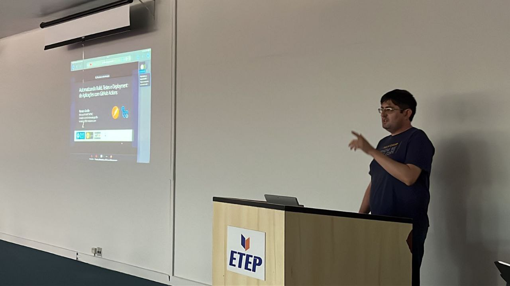
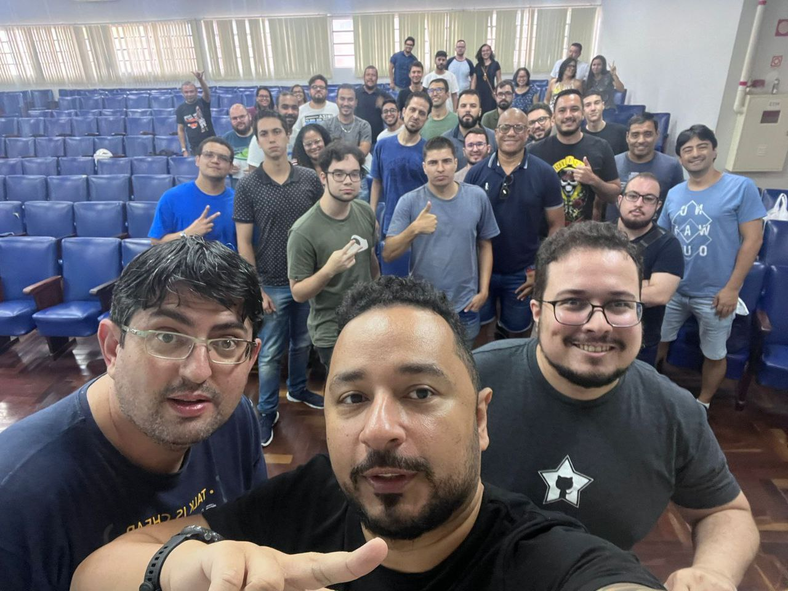

# Talk-GitHubActions-APIs-TechSaturday2023
Informações (dados gerais + prints) + slides sobre a apresentação que realizei durante a **1a edição em 2023** do **Tech Saturday**, um evento realizado na cidade de **São José dos Campos-SP** no dia **25/02/2023**.

Título da Apresentação: **Automatizando o Build, Testes e Deployment de APIs REST com GitHub Actions**

Tecnologias utilizadas: **GitHub Actions**, **Postman**, **Newman**, **npm**, **JavaScript**, **Docker**, **Docker Hub**, **.NET 7**, **ASP.NET Core**

Número de participantes: **35 pessoas**

Repositório utilizado: [**link**](https://github.com/renatogroffe/GitHubActions-Postman-Newman-DockerHub-TestSummary_APIFinancas)

Local: **ETEP Esplanada - Avenida Barão do Rio Branco, 882, Jardim Esplanada - São José dos Campos - SP**

Formulário utilizado para inscrições: [**Sympla**](https://www.sympla.com.br/evento/tech-saturday-presencial-1/1864237)

Deixo aqui meus agradecimentos ao **Julio Arruda (Microsoft MVP, GitHub Star)**, ao **Henrique Eduardo Souza (Microsoft MVP)** e ao [**Centro Universitário ETEP**](https://etep.edu.br/) por todo o apoio para que eu partipasse como palestrasse do **Tech Saturday**.

---

